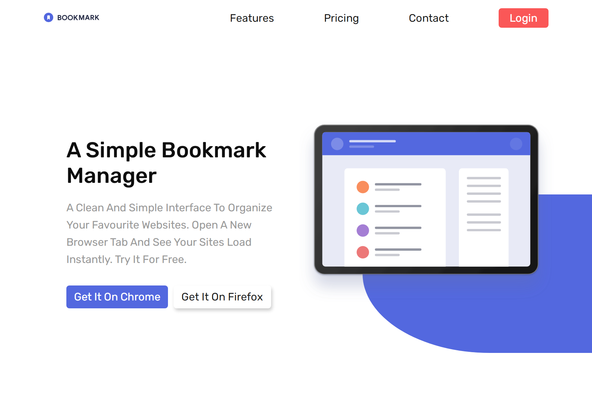

# Frontend Mentor - Bookmark landing page solution

This is a solution to the [Bookmark landing page challenge on Frontend Mentor](https://www.frontendmentor.io/challenges/bookmark-landing-page-5d0b588a9edda32581d29158).

## Table of contents

-   [Overview](#overview)
    -   [The challenge](#the-challenge)
    -   [Screenshot](#screenshot)
    -   [Links](#links)
-   [My process](#my-process)
    -   [Built with](#built-with)
    -   [What I learned](#what-i-learned)
    -   [Continued development](#continued-development)
-   [Author](#author)

## Overview

My own attempt to solve this challenge

### The challenge

Users should be able to:

-   View the optimal layout for the site depending on their device's screen size
-   See hover states for all interactive elements on the page
-   Receive an error message when the newsletter form is submitted if:
    -   The input field is empty
    -   The email address is not formatted correctly

### Screenshot



### Links

-    [Solution URL]()
-    [Live Site URL](https://ymhaah.github.io/bookmark/)

## My process

It had so many challenges that I had to use javascript and The challenge was to come up with a small and effective code and not just a code that works

### Built with

-   Semantic HTML5 markup
-   CSS custom properties
-   Flexbox
-   CSS Grid
-   Mobile-first workflow

### What I learned

Use this section to recap over some of your major learnings while working through this project. Writing these out and providing code samples of areas you want to highlight is a great way to reinforce your own knowledge.

To see how you can add code snippets, see below:

```html
<form action="">
	<input
		type="email"
		placeholder="Enter your Email"
		required
		minlength="5"
		maxlength="100"
		inputFiled
	/>
	<button type="submit" button class="redButton">Contact Us</button>
</form>
```

```css
:root {
	--big-font: calc(2.8rem + 1.5vw);
	--medium-font: calc(2rem + 1.3vw);
	--small-font: calc(0.8rem + 1.2vw);
}
```

```scss
@mixin flex($direction, $justify, $align) {
	display: flex;

	// for flex direction
	@if $direction == "r" {
		flex-direction: row;
	} @else if $direction == "rr" {
		flex-direction: row-reverse;
	} @else if $direction == "c" {
		flex-direction: column;
	} @else if $direction == "cr" {
		flex-direction: column-reverse;
	} @else {
	}

	// for justify
	@if $justify == "c" {
		justify-content: center;
	} @else if $justify == "fs" {
		justify-content: flex-start;
	} @else if $justify == "fe" {
		justify-content: flex-end;
	} @else if $justify == "sa" {
		justify-content: space-around;
	} @else if $justify == "sb" {
		justify-content: space-between;
	} @else if $justify == "se" {
		justify-content: space-evenly;
	} @else {
	}

	// for align
	@if $align == "c" {
		align-items: center;
	} @else if $align == "fs" {
		align-items: flex-start;
	} @else if $align == "fe" {
		align-items: flex-end;
	} @else {
	}
}
```

```js
let lines = [...document.querySelectorAll(".line")];
let content = [...document.querySelectorAll(".artc")];
let special = "";

lines.forEach(function (ele) {
	ele.onclick = function () {
		special = ele;
		for (let i = 0; i < lines.length; i++) {
			if (lines[i] == special) {
				lines[i].classList.add("act");
				content[i].classList.add("vis");
			} else if (lines[i] != special) {
				lines[i].classList.remove("act");
				content[i].classList.remove("vis");
			}
		}
	};
});
```

### Continued development

-   html seo
-   scss mixin
-   js general skills

## Author

-   github - [youssef hafnawi](https://github.com/ymhaah)
-   Twitter - [@hafanwi](https://twitter.com/hafanwi)
